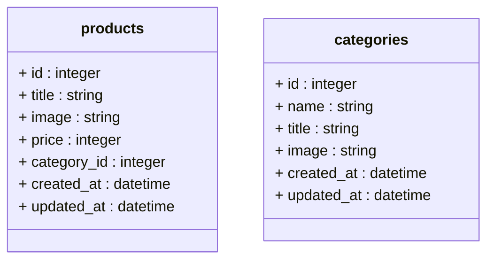

# テーブル構成

```mermaid
classDiagram

class products {
    + id : integer
    + title : string
    + image : string
    + price : integer
    + category_id : integer
    + created_at : datetime
    + updated_at : datetime
}

class categories {
    + id : integer 
    + name : string
    + title : string
    + image : string
    + created_at : datetime
    + updated_at : datetime
}

```
